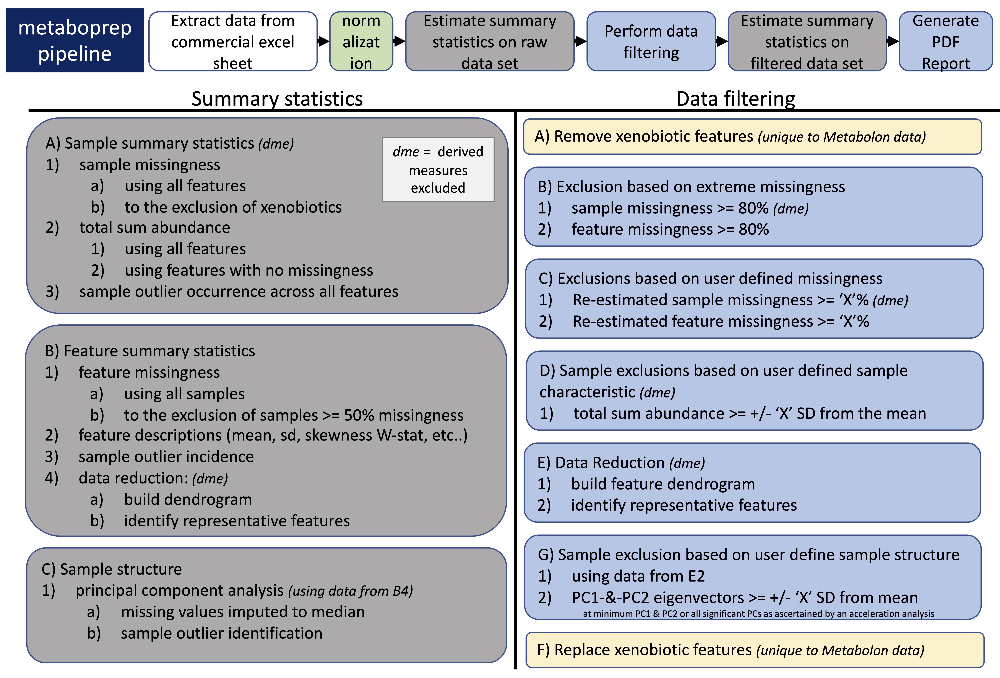

```{r setup, echo = FALSE}
knitr::opts_chunk$set(
  echo = FALSE, quote = FALSE, comment = NA,
  warning = FALSE, message = FALSE, error = FALSE,
  fig.align = "center"
)

library(ggplot2)
library(data.table)
library(kableExtra)
library(knitr)
library(glue)
```


\newpage

# Project Information

This `metaboprep2` report summarizes the data preparation steps for:

- **Project:** `r metabolites@project_name`  
- **Platform:** `r metabolites@format`  
- **Data processing date:** `r as.Date(metabolites@created)`  

## Overview

The `metaboprep` R package performs three key operations:

1. **Assessment & Summary Statistics**: Provides an initial assessment of raw metabolomics data.
2. **Data Filtering**: Applies filtering techniques to clean the dataset.
3. **Post-Filtering Assessment**: Evaluates the filtered dataset, particularly in relation to batch variables when available.

This report contains descriptive information on both raw and filtered metabolomics data for **`r metabolites@project_name`**.

Please raise any issues on the [GitHub issues](https://github.com/nicksunderland/metaboprep2/issues) page. 


## Data preparation workflow:
```{r workflow, out.width="80%"}

```

\newpage

# Summary of raw data

## Sample size of `r metabolites@project_name` data set:  

```{r sample_size, echo=FALSE, results = 'asis'}
# extract
sample_size_table <- lapply(dimnames(metabolites@data)[[3]], function(layer_name) {
  
  data <- get_data(metabolites, type=layer_name, apply_exclusions = TRUE)
  
  list(`Dataset`  = toupper(gsub("_"," ",layer_name)), 
       `Samples`  = nrow(data), 
       `Features` = ncol(data)) 
  
}) |> data.table::rbindlist()

# table
sample_size_table |>
  knitr::kable(
    caption = "Sample Size Table",
  ) |>
  kableExtra::kable_styling(
    position = "center",    
    full_width = FALSE,     
    bootstrap_options = c("striped", "hover") 
  ) |> 
  row_spec(0, bold = TRUE) 

```


# Missingness
Missingness is evaluated across samples and features using the original/raw data set. 

## Visual structure of missingness in the raw data
```{r missing_matrix}
# raw data
namat <- metabolites@data[, , 1] 
namat[!is.na(namat)] <- 1 
namat[is.na(namat)] <- 0   
namat <- reshape::melt(namat)
colnames(namat) <- c("individuals", "metabolites", "missingness")
namat$missingness <- factor(namat$missingness, levels = c(0, 1), labels = c("Missing", "Present"))

# plot
ggplot(namat, aes(x = metabolites, y = individuals, fill = missingness)) + 
  geom_tile(color="#E6E6E6") + 
  scale_fill_manual(values = c("Missing" = "red", "Present" = "white")) +
  theme(
    legend.position = "bottom",  
    axis.text.x = element_blank(),
    axis.text.y = element_blank(),
    axis.ticks  = element_blank()
  ) +
  labs(
    x = "Metabolites",  
    y = "Individuals",  
    fill = "Missingness"  
  )
```

## Summary of sample and feature missingness 
```{r missing_summary}
# raw data 
data <- metabolites@data[, , 1] 

# calculate missingness
missing <- data.table::data.table(
  Samples  = apply(data, 1, function(x){ sum(is.na(x))/length(x)  }),
  Features = apply(data, 2, function(x){ sum(is.na(x))/length(x)  })
) |> data.table::melt(id.vars = NULL, variable.name = "type", value.name = "missingness")
  
# quantile distribution of missingness table
tbl1 <- missing[, .(percentile  = seq(0, 1, 0.25), 
                     missingness = stats::quantile(missingness)), by="type"] |> 
  data.table::dcast(percentile ~ type, value.var = "missingness") |>
  knitr::kable(
    caption = "Table of sample and feature missingness percentiles.",
    col.names = c("Percentile", "Samples", "Features"),
    digits = 4,
    format = ifelse(knitr::is_html_output(), "html", "latex")
  ) |>
  kableExtra::kable_styling(
    full_width = FALSE,
    position = "center",
    bootstrap_options = c("striped", "hover")
  ) |> 
  row_spec(0, bold = TRUE) 


# Estimates of sample size given various levels of missingness
sq <- seq(0.1, 0.5, 0.1)
fmiss_samplesize <- data.table(
  `Missingness (%)` = scales::percent(sq, accuracy = 1), 
  `Sample Size` = sapply(sq, function(x){ nrow(data)*(1-x) })
) 

# tables together
tbl2 <- fmiss_samplesize |>
  knitr::kable(
    caption = "Estimates of samples sizes under various levels of feature missingness.",
    format = ifelse(knitr::is_html_output(), "html", "latex")
  ) |>
  kableExtra::kable_styling(
    full_width = FALSE,
    position = "center",
    bootstrap_options = c("striped", "hover")
  ) |> 
  row_spec(0, bold = TRUE) 

# missing histograms
miss_hists <- ggplot(missing, aes(x = missingness, fill=type)) + 
  geom_histogram(fill = "lightblue" , bins = 25) + 
  geom_vline(data = missing[, .(median = median(missingness)), by="type"], 
             aes(xintercept = median), color = "darkred", size = 1) +
  theme_bw() +
  labs(x = "Missingness", y = "Counts", 
       caption = "Distribution of missingness with median illustrated by the red vertical line.") +
  theme(strip.background = element_blank(), 
        strip.text = element_text(size=12)) +
  facet_wrap(~type)
  

# print
tbl1
tbl2
miss_hists
```


# 2. Data Filtering  

## Exclusion summary  
```{r exclusion_table}
excl_mat <- as.array(metabolites@exclusions[, , "post_qc"])
codes <- get_exclusion_codes(verbose = FALSE)

# table
tbl1 <- data.table::data.table(
  `Exclusion Reason` = gsub("_"," ", names(codes)), 
  `Count`            = sapply(codes, function(code) sum(apply(excl_mat, 1, function(row) sum(row == code)) > 0))
) |> 
  knitr::kable(
    caption = "Sample exclusion summary",
    format = ifelse(knitr::is_html_output(), "html", "latex")
  ) |>
  kableExtra::kable_styling(
    full_width = FALSE,
    position = "center",
    bootstrap_options = c("striped", "hover")
  ) |> 
  row_spec(0, bold = TRUE) 

# notes
general_note <- "Six primary data filtering exclusion steps were made during the preparation of the data. User-defined thresholds indicated with an asterisk."
sub_notes <- c(
  "Samples with missingness >=80%.",
  "Features with missingness >=80% (xenobiotics are not included in this step).",
  paste0("Sample exclusions based on the user defined threshold of >=", sprintf('%.0f%%', metabolites@sample_missingness*100), "."),
  paste0("Feature exclusions based on user defined threshold of >=", sprintf('%.0f%%', metabolites@feature_missingness*100), ", (xenobiotics are not included in this step)."),
  paste0("Samples with a total-peak-area or total-sum-abundance that is >=", metabolites@total_peak_area_sd, " standard deviations from the mean."),
  paste0("Samples that are >= ", metabolites@outlier_udist, " standard deviations from the mean on principal component axis 1 and 2")
)

tbl1 |> 
  footnote(
    general_title    = "Note: ",
    general          = general_note, 
    number           = sub_notes,
    footnote_as_chunk = knitr::is_html_output(),
    threeparttable   = !knitr::is_html_output(),
    fixed_small_size = TRUE
  )
```


## Next
dsaq
